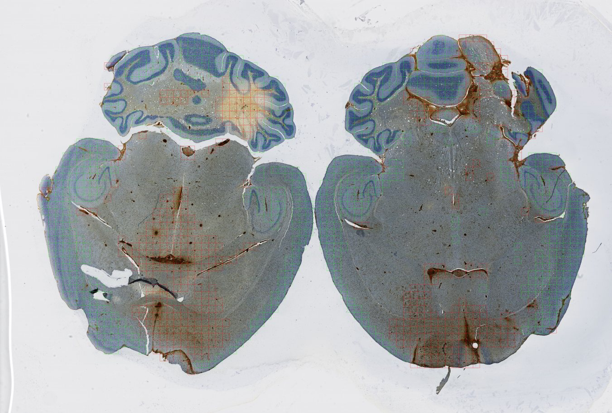

# Uncovering the Genetic Basis of Glioblastoma Heterogeneity through Multimodal Analysis of Whole Slide Images and RNA Sequencing Data

*Ahmad Berjaoui, Eduardo Hugo Sanchez, Louis Roussel, Elizabeth Moyal Cohen-Jonathan*

<div align="center">
    
</div>


This repository contains the code and scripts to download and preprocess the data mentioned in our paper. The latest version of the paper can be found at this [address](https://arxiv.org/abs/2410.18710)

## Data

Data can be provided by the authors upon request. The data can only be used for research purposes and cannot be redistributed. Please cite the paper if you use the data. Commercial use is strictly prohibited. The data is organized as follows:

- **WSI**: Whole Slide Images used for training the AI models.
- **RNA-seq**: The RNA-seq encoder was pre-trained using data from The Cancer Genome Atlas (TCGA). The data needs to be downloaded to `gbdata/rna/tcga`. Oncopole RNA-seq raw data is in `gbdata/rna/oncopole_rna_raw.tsv`. Normalized RNA-seq Oncopole data needs to be downloaded to `gbdata/rna/oncopole`. All RNA-seq data has already been normalized using the `DESeq2` package.
- **Gene clustering**: Gene clustering uses the protein-to-protein interaction (PPI) graph from [Precision Medecine Knowledge Graph](https://dataverse.harvard.edu/file.xhtml?fileId=6180620&version=2.1). Only genes that are present in both the PPI knowledge graph and the RNA seq data have been kept. The filtered PPI graph CSV file can be found in `gbdata/gene_clustering`. The cluster to genes mapping is in `gbdata/gene_clustering/ppi_cluster_to_ensembl_genes.json`. The paper compares using this cluster against a mere chromosome to gene mapping, which can be found in `gbdata/gene_clustering/chromosome_to_ensembl_genes.json`.
- **Survival**: Patient survival data (OS and PFS) is in `gbdata/survival/patients.csv` . Mice survival data (lineage dependant) is in `gbdata/survival/lineage.csv`.

## Quickstart

### Installation

1. Clone the repository: `git clone https://github.com/ma3oun/gbheterogeneity.git`
2. Install the dependencies using `uv sync`
3. Download the data and place it in the `gbdata/rna` for `tcga.tar.gz` and `gbdata/wsi` for `wsi.tar.gz`. Unzip the files in their respective folders by using `tar -xvf tcga.tar.gz` and `tar -xvf wsi.tar.gz`.
4. You can also download trained models to avoid retraining them from scratch. Place them in the `trained_models` folder.
5. Set PYTHONPATH to the root of the repository: `export PYTHONPATH=$(pwd)`

## Data processing

### Gene clustering

1. Download the PPI graph from [Precision Medecine Knowledge Graph](https://dataverse.harvard.edu/file.xhtml?fileId=6180620&version=2.1) and place it in `gbdata/gene_clustering/kg.csv`.
2. Run `uv run gene_clustering/ppi_filtering.py` to filter the PPI graph to keep only genes that are present in both the PPI graph and the RNA seq data. This will create the `gbdata/gene_clustering/ppi_filtered.csv` file.
3. Run `uv run gene_clustering/ppi_clustering.py` to cluster the genes using the PPI graph and the Louvain algorithm. This will create the `gbdata/gene_clustering/ppi_cluster_to_ensembl_genes.json` file.

### RNA encoder pre-training

A pretrained model is available in `trained_models/rna_encoder.bin`. To train the RNA encoder from scratch, run `uv run scripts/pretrain_rna.py`. This will create the `trained_models/rna_encoder.bin` file. Note that the default training uses ppi clustering. To use chromosome clustering, modify the script to point to `gbdata/gene_clustering/chromosome_cluster_to_ensembl_genes.json` instead.

### WSI encoder pre-training

A pretrained model is available in `trained_models/wsi_encoder.bin`. To train the WSI encoder from scratch, run `uv run scripts/pretrain_wsi.py`. This will create the `trained_models/wsi_encoder.bin` file.

### Multimodal training

Multimodal training uses distributed data parallelism to train the model on multiple GPUs. To train the model, first activate the environment with `source .venv/bin/activate` and then run `torchrun standlone --nnodes=1 --nproc_per_node=<number_of_gpus> scripts/train_multimodal_full.py`. If you want to use a specific GPU, you can set the `CUDA_VISIBLE_DEVICES` environment variable before running the command. For example, to use GPU 0, run `CUDA_VISIBLE_DEVICES=0 torchrun standlone --nnodes=1 --nproc_per_node=1 scripts/train_multimodal_best.py`.

### Evaluation

Multimodal evaluation for RNA retrieval can be run with `uv run scripts/evaluate_retrieval.py`. Use MLflow to track the results.

### Visualization

Grad-CAM visualization can be run with `uv run scripts/compute_rna_gradcams.py` and `uv run scripts/compute_wsi_gradcams.py`. Use MLflow to view the results.

### Variants

The `scripts/variants` directory contains scripts to train and evaluate variants of the model, including the model with frozen encoders (RNA and WSI) and the model using chromosome based clustering for the RNA encoder.

## 🙏 Acknowledgments

The results shown here are in part based upon data generated by the [TCGA Research Network](https://www.cancer.gov/tcga). The authors would like to thank Caroline Delmas and Antony Lemarié (*INSERM UMR 1037 Cancer Research Center of Toulouse (CRCT), University Paul Sabatier Toulouse III*) for WSI and RNA-seq data acquisition.

## 🗞️ Citation

If you use this code or data as part of your workflow in a scientific publication, please consider citing the 🗞️ [official paper](https://arxiv.org/abs/2410.18710):

```
@article{berjaoui2024uncovering,
  title={Uncovering the Genetic Basis of Glioblastoma Heterogeneity through Multimodal Analysis of Whole Slide Images and RNA Sequencing Data},
  author={Berjaoui, Ahmad and Roussel, Louis and Sanchez, Eduardo Hugo and Moyal, Elizabeth Cohen-Jonathan},
  journal={arXiv preprint arXiv:2410.18710},
  year={2024}
}
```

## 📝 License

This code is licensed under the [GPL v3.0](https://choosealicense.com/licenses/gpl-3.0/) license
